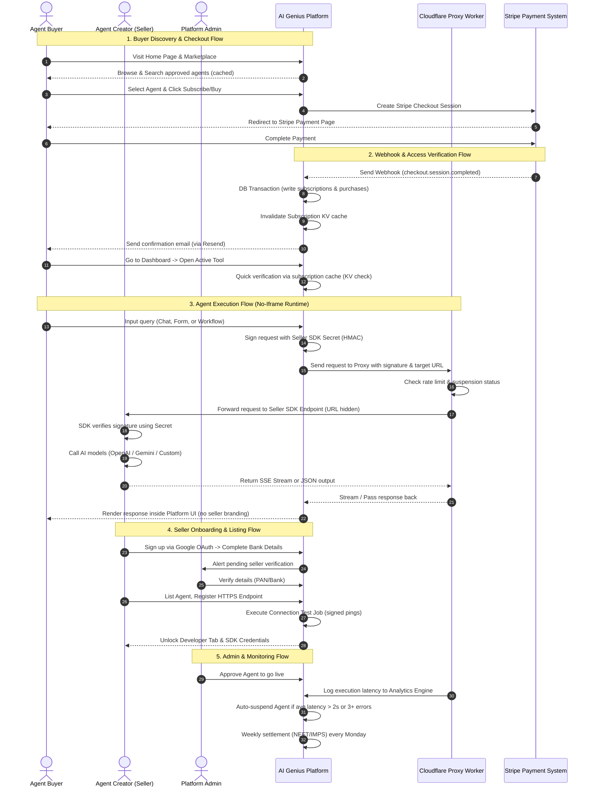

# AI Genius Marketplace — Complete User & Role Journeys (Detailed Flow)

This document provides a highly detailed, step-by-step breakdown of how the **AI Genius Marketplace** operates across all three system roles: **Agent Buyer (User)**, **Agent Creator (Seller)**, and **Platform Owner (Admin)**. It details every touchpoint, database operation, API contract, and edge case in the system.

---

## 🗺️ System Overview & High-Level Architecture

The AI Genius platform functions as a single unified marketplace where sellers offer digital assets (workflows, AI templates) or hosted AI backend services. 

### 🔑 Core Architectural Shift (v4.0 SDK Architecture)
Unlike previous versions which relied on embedding seller tools via iframes (which posed critical security and branding risks), **v4.0 introduces the `@aigenius/sdk` model**. 
1. **The Platform Owns the UI:** All chat windows, forms, and workflows are rendered natively by the platform using clean, optimized Tailwind CSS and `shadcn/ui` components.
2. **Sellers Own the Backend Logic:** The seller installs our lightweight Node.js SDK and runs only a backend API that receives requests and returns standard JSON or SSE (Server-Sent Events) streams.
3. **No Exfiltrations & Full Security:** Real customer emails, Stripe customer IDs, and seller endpoint URLs are strictly hidden. Requests are authenticated via HMAC-SHA256 signatures.



---

## 👤 Role 1: The Agent Buyer (User) Journey

The Buyer is the end customer who visits the platform, discovers AI tools, subscribes to them, and runs them within our premium interface.

### Step 1: Discovery & Entry (Marketplace Landing)
* **First Touch:** The buyer lands on the landing page or navigates to `/marketplace`.
* **Curation over Chaos:** The home page shows **Admin-Curated Featured Agents** to ensure early-stage quality control.
* **Smart Search:** The buyer types in the search bar. This queries the backend API (`GET /api/agents`), using PostgreSQL full-text search vectors combined with cursor-based pagination for high performance.
* **Pre-Computed Metrics:** The "Subscribers count" and "Ratings" shown on agent cards are denormalized columns on the `agents` table, maintained by database triggers. This makes page loads instant (`O(1)` read) without requiring heavy database JOIN operations on every browse.
* **No Direct Purchase from Cards:** Clicking on a card redirects the buyer to the **Agent Detail Page** (`/marketplace/[agentId]`). This forces the user to review pricing plans, verified reviews, and features, lowering refund rates by ~60%.

### Step 2: Frictionless Google-Only Auth
* **One-Click Login:** AI Genius implements **Google OAuth** as its single, friction-free login method.
* **Auth Callback Flow (`/auth/callback`):**
  1. The browser redirects from Google with a session token.
  2. The server handles token exchange and executes a single atomic database upsert:
     ```sql
     INSERT INTO users (supabase_id, email, name, avatar_url, role)
     VALUES ($1, $2, $3, $4, 'buyer')
     ON CONFLICT (email) DO NOTHING;
     ```
  3. The system checks the `callbackUrl` parameter (preventing open redirect vulnerabilities) and routes the user:
     * `buyer` $\rightarrow$ `/dashboard`
     * `seller` $\rightarrow$ `/dashboard/seller`
     * `admin` $\rightarrow$ `/admin`

### Step 3: Premium Checkout & Webhook Settlement
* **Checkout Generation (`POST /api/checkout`):**
  1. The server checks if the user is already subscribed via the KV Cache. If yes, it redirects them directly to the tool.
  2. It fetches user and agent details in parallel.
  3. It validates or registers a Stripe Customer ID for the user.
  4. It creates a Stripe Checkout Session with an **Idempotency Key** (`checkout:{userId}:{agentId}:{planType}:{date}`) to prevent duplicate transactions.
* **Stripe Webhook Processing (`POST /api/webhooks`):**
  Upon successful payment, Stripe triggers `checkout.session.completed` asynchronously:
  1. **Atomic DB Transaction:** Writes a new record to the `subscriptions` table (marked as `active`) and adds a ledger entry to the `purchases` table mapping the transaction, platform fee (15%), and seller payout (85%).
  2. **Cache Invalidation:** Instantly clears the Redis/Cloudflare KV cache for this subscription.
  3. **Transactional Notifications:** Fires an automated confirmation email to the buyer via Resend.

### Step 4: Accessing the Tool (The Gatekeeper)
* **Access Request:** The user clicks "Open Tool" and lands on `/tools/[agentId]`.
* **Zero DB-Hit Check:** A Next.js Server Component checks if the user is authorized. It queries the Cloudflare KV cache (`sub:{userId}:{agentId}`).
  * **Cache Hit:** If active and valid, access is granted instantly.
  * **Cache Miss:** Queries the PostgreSQL DB, caches the outcome for 5 minutes, and permits/blocks entry.
* **UI Router:** The page queries the `agent.type` (Chat, Form, or Workflow) and dynamically mounts the platform's native runtime UI components:
  * `<ChatUI>` (resembles ChatGPT with markdown streaming support).
  * `<FormUI>` (renders custom fields dynamically based on the agent's input JSON schema).
  * `<WorkflowUI>` (displays multi-step progress cards).

### Step 5: Secure Execution Flow (The Bridge API)
* **Private Network Forwarding:** To execute the AI, the user’s browser posts to `/api/tools/[agentId]/run`. The browser **never** communicates with the seller's server directly.
* **HMAC Request Signature:** The platform builds a base64 request payload container containing the transaction context (`userId`, `planType`, etc.) and signs it using the seller's secret:
  $$\text{Signature} = \text{HMAC-SHA256}(\text{sdkSecret}, \text{timestamp} \mathbin{\Vert} \text{agentId} \mathbin{\Vert} \text{payload})$$
* **Secure Cloudflare Proxy Worker:**
  1. Next.js forwards this request to a secure Cloudflare Worker proxy, appending the secret header `X-Platform-Worker-Secret` (so only our server can invoke it).
  2. The Worker performs O(1) checks:
     * **Suspension Status:** Instantly rejects requests if the agent has been suspended by an Admin or auto-throttled due to latency.
     * **User Rate Limiting:** Enforces a hard limit of 60 requests per minute per user per agent.
  3. The Worker strips platform headers and forwards the clean request to the seller's registered HTTPS endpoint.
* **Real-time Streaming:** If the seller’s backend replies with a `text/event-stream` (SSE), the Worker pipes these tokens directly back to the buyer's UI in real time.
* **Error Handling & Banners:**
  * If the seller's server takes $>30\text{s}$, the proxy times out $\rightarrow$ Buyer sees: *"The agent took too long to respond. Try again."*
  * If the seller returns consecutive server errors $\rightarrow$ Buyer sees a clean error card, and the system logs this to flag the agent for review.

---

## 🧑‍💻 Role 2: The Agent Creator (Seller) Journey

Sellers are tech-savvy developers or non-tech automation creators who list their assets, configure integrations, and collect payouts.

### Step 1: Seller Onboarding & Payout Setup
* **Registration:** A logged-in buyer clicks "Sell on AI Genius" on `/sell` and registers $\rightarrow$ their user role updates to `seller` and a profile is created.
* **Direct Bank Settlements (No Stripe Connect):** 
  To simplify operations, **AI Genius does not use Stripe Connect Express accounts**. Instead, the platform collects all payments via a single central Stripe account. Sellers provide their standard bank account/IFSC or UPI ID for direct local transfers (e.g., NEFT/IMPS).
* **Tax Compliance & Verification:**
  1. The seller submits their business details, PAN (tax number), and bank details on the onboarding screen.
  2. The platform encrypts these sensitive fields at rest using AES-256 via Supabase Vault.
  3. The profile status is set to `pending_verification`. Once verified by an Admin, the seller is granted listing permissions.

### Step 2: The Three Seller Archetypes

Sellers can list their products using one of three system paths:

#### 1. Non-Tech Sellers (Workflows & Templates)
* **Product:** Sells configuration files (e.g., n8n, Make, or Zapier JSON files).
* **Model:** One-time purchase.
* **Listing Flow:**
  1. Uploads the workflow JSON file (max 10MB) to a private Supabase storage bucket.
  2. The system scans the JSON file for embedded API keys or passwords. If detected, the file is instantly rejected.
  3. The seller uploads screenshots and writes markdown setup instructions.
  4. The listing goes to the Admin Queue for manual import validation.

#### 2. Tech Sellers (Self-Hosted Backends)
* **Product:** Integrates an active backend server with the platform.
* **Model:** Subscription.
* **Listing Flow:**
  1. The seller registers an HTTPS endpoint (e.g., `https://api.writebot.com/v1/run`).
  2. They configure the UI parameters in the dashboard (e.g., chat starter questions, dynamic form input schemas).
  3. The system fires a **Connection Test Job**: pings the endpoint 5 times with signed test packages.
  4. **Test Pass $\rightarrow$ Credentials Unlock:** If the endpoint responds successfully ($<5\text{s}$ average latency and $0\%$ error rate), the platform displays the **SDK Secret Key** and **Agent ID** to the seller.

#### 3. Tech Sellers with Weak Infra (Managed Hosting)
* **Problem:** Some developers build functional tools but host them on unreliable or slow servers, failing the platform’s performance tests.
* **Managed Solution:** AI Genius offers a Docker container hosting service for a flat fee of **Rs 500/month**.
* **Managed Flow:**
  1. The seller subscribes to a hosting tier in their dashboard.
  2. They provide a public Docker Image URL (e.g., `hub.docker.com/r/myusername/myagent`) and input their environment variables.
  3. The Admin provisions a secure isolated container inside the platform's **Coolify** infrastructure (hosted on high-speed Hetzner servers).
  4. The platform updates the agent's endpoint to the new managed URL and unlocks their SDK credentials.

### Step 3: Integrating the `@aigenius/sdk`
Integrating an agent takes less than an hour. The seller installs our lightweight package:

```bash
npm install @aigenius/sdk
```

They implement a clean, secure handler in their backend code:

```typescript
import { createAgent } from '@aigenius/sdk'
import OpenAI from 'openai'

// 1. Initialise the SDK with platform credentials
const agent = createAgent({
  secret: process.env.AIGENIUS_SECRET!,
  agentId: process.env.AIGENIUS_AGENT_ID!
})

const openai = new OpenAI()

// 2. The SDK automatically verifies HMAC signatures and structures incoming payloads
export const POST = agent.handler(async (ctx, req) => {
  // Access plan levels to limit responses (e.g., annual vs monthly tier limits)
  const maxTokens = ctx.plan === 'annual' ? 4000 : 2000

  const stream = await openai.chat.completions.create({
    model: 'gpt-4o',
    messages: req.messages!,
    stream: true,
    max_tokens: maxTokens
  })

  // 3. Helper to format standard OpenAI streams into SSE blocks for our runtime UI
  return agent.stream(async function* () {
    for await (const chunk of stream) {
      const token = chunk.choices[0]?.delta?.content
      if (token) yield token
    }
  }())
})
```

### Step 4: Tracking Earnings & Settlements
* **Analytics Engine:** Sellers track visitor counts, daily active users, subscription counts, and performance metrics directly inside `/dashboard/seller`.
* **Monday Settlements:** Platform runs a billing cron job every Monday. It checks all `pending` settlements from the prior week, deducts the platform's 15% fee, applies any TDS (tax deducted at source) requirements, and processes direct NEFT/IMPS transfers to the seller's bank.

---

## 👑 Role 3: The Platform Owner (Admin) Journey

The Admin runs the marketplace operations, manages security, provisions containers, reviews disputes, and executes weekly payouts.

### Step 1: Secure Admin Auth Gate
* **Dedicated Gate:** Access is gated behind `/admin/login`, which uses strict Supabase Email/Password credentials and is separated from standard buyer/seller authentication.
* **Role Check:** Next.js middleware blocks access unless `users.role === 'admin'`. Admin accounts are created manually in the database to prevent public sign-ups.

### Step 2: The Admin Review & Approval Queue
* **Review Queue (`/admin/pending`):** All new agents, workflows, and updated endpoints sit in this queue.
* **Verification Checklist:**
  Before approving an agent, the admin runs through an interactive checklist:
  * **Branding Audit:** Opens the tool in a sandbox to ensure no seller logos, direct links, or WhatsApp contact buttons exist.
  * **Functionality Check:** Submits prompts to ensure the agent does what is promised in the description.
  * **Performance Audit:** Inspects the auto-generated report of the Connection Test Job.
* **Approval/Rejection:**
  * **Approve:** Updates status to `approved`. The platform invalidates the marketplace KV cache to make the tool live instantly.
  * **Reject:** Enters a manual reason (e.g., "Found seller website links in response text"), updates status to `rejected_manual`, and automatically emails the seller with a resubmission link.

### Step 3: Real-Time Performance & Auto-Suspension
* **The Monitoring Dashboard (`/admin/monitor`):** The admin views a live table showing the health of all live seller integrations.
* **Cloudflare Analytics Integration:** The Cloudflare Worker logs every single execution latency and response status code.
* **Auto-Suspension Safeguards:**
  To maintain premium quality, an automated platform cron job checks live latencies:
  * **Slow Latency Warning:** If average latency exceeds 2 seconds over the last 10 requests $\rightarrow$ Flags a yellow warning on the Admin panel.
  * **Auto-Throttling:** If an agent average response time exceeds 2 seconds for 15 consecutive minutes OR returns 3 consecutive 5xx errors $\rightarrow$ The system automatically suspends the agent, sets its status in KV cache to suspended (instantly blocking new requests at the edge), and emails the seller with a diagnostic report.
  * **Manual Override:** Admins can manually suspend, restore, or whitelist specific agents (e.g., enterprise partners).

### Step 4: Managed Hosting Provisioning
* When a seller requests managed hosting and their Stripe subscription succeeds, the agent appears in `/admin/hosting`.
* The admin reviews the Docker Image URL and clicks **"Provision in Coolify"**.
* This triggers an automated call to the internal Coolify API to set up the container, inject encrypted environment variables, map a subdomain (`[agentId].hosted.aigenius.com`), and run an automated connection test.

### Step 5: Disputes, Refunds & Fraud Management
* **Dispute Center (`/admin/disputes`):** Admins manage customer support and refund requests.
* **Refund Rules:**
  * If a refund is requested within 7 days of purchase and the user has not actively used the tool $\rightarrow$ Stripe processed a full refund.
  * **Ledger Balancing:** If the seller has not yet been paid for this period, the transaction status in `purchases` updates to `refunded`, preventing payout. If already settled, the amount is deducted from the seller's next settlement cycle.
* **Fraud Detection Filters:**
  The admin panel highlights accounts triggered by automated security filters:
  1. Multiple accounts created from the same IP in under 1 hour.
  2. Buyers requesting refunds $>2$ times in 30 days.
  3. Sellers generating transactional volume with zero real execution logs (indicates fake review/purchase loops).

### Step 6: Weekly Settlement Processing
Every Monday at 10:00 AM IST, the admin initiates the weekly settlement script:
1. It queries all purchases marked as `settlementStatus = 'pending'` from the prior week.
2. It aggregates these by seller, calculating their 85% share.
3. It exports a bank-compliant NEFT/IMPS transfer CSV file.
4. Once the bank transfer completes, the admin uploads the execution log, updating purchase statuses to `settled`.

---

## 🛠️ Summary: Key DB Schemas Supporting the Flows

These primary tables in `src/db/schema.ts` enforce state consistency throughout the user journeys:

| Table | Key Columns | Purpose |
|---|---|---|
| **`users`** | `id`, `supabase_id`, `email`, `name`, `role` (`buyer`, `seller`, `admin`), `stripe_customer_id` | Stores all platform accounts. |
| **`seller_profiles`** | `user_id`, `business_name`, `settlement_status` (`pending`, `verified`), `payout_ledger` | Manages seller bank verifications. |
| **`agents`** | `id`, `seller_id`, `name`, `type` (`chat`, `form`, `workflow`), `status` (`approved`, `pending_review`, `suspended`), `endpoint_url`, `sdk_secret`, `agent_config` (JSONB) | Contains active AI definitions and UI schemas. |
| **`subscriptions`** | `id`, `buyer_id`, `agent_id`, `stripe_subscription_id`, `status` (`active`, `cancelled`, `past_due`), `current_period_end` | Tracks active buyer access. |
| **`purchases`** | `id`, `buyer_id`, `agent_id`, `seller_id`, `amount_paise`, `platform_fee_paise`, `seller_payout_paise`, `settlement_status` (`pending`, `settled`, `refunded`) | The transactional ledger for Monday payouts. |
